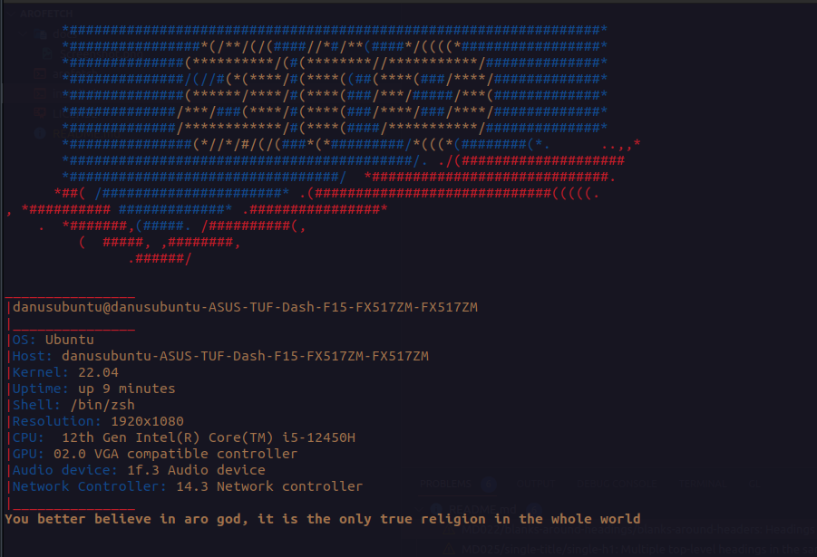

# arofetch
a cool neofetch theme of ARO water, enjoy

# Installation and usage

This amazing script is very human, in order to have this godly terminal app functional, follow these holy steps:

## Installation

1) `git clone https://github.com/ARO-developers/arofetch.git`
clone this github repo
2) `cd arofetch`
3) `sh install.sh` install arofetch for it to be global
4) put command `arofetch` into `.zshrc`, `.bashrc` etc.
depending on the terminal you are using.

**NOTE:** Do not delete this repository! It will be helpful for you to update arofetch with any upcoming updates.

## Updating

Updating is simple, just run `sh install.sh update` and whole arofetch script will be reinstalled.

# Summary

**NOTE:** Script will probably ask you about sudo rights, thats because you cannot copy a file to `/usr/local/bin` without sudo rights. 

### this theme still doesnt work for windows, and it was only tested on arch linux and debian-like distros
